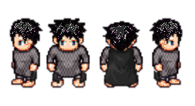

# universal-sprites

This will eventually be a javascript-based version of tools and an editor, sort of like [Universal-LPC-Spritesheet-Character-Generator](http://gaurav.munjal.us/Universal-LPC-Spritesheet-Character-Generator/).

It's deployed [here](https://notnullgames.github.io/universal-sprites/). For now, this is a work-in-progress, but I hope that eventually a user can set custom skin-color, set head-shape, set stout/voluptuos, and have all accessories and stuff fit.

[Here](https://opengameart.org/content/lpc-orc-punk-and-dead-princess) is some discussion on OpenGameArt.

## the plan

* Dynamic colors for clothes (like I have hair & skin.)
* Go through and fill in all the missing frames for clothes
* Use an indexed pallette that can be swapped, for things that have colors.
* Make female/male versions of the clothes, which is sometimes just placement (there is some ruby code in [Universal-LPC-spritesheet repo](https://github.com/jrconway3/Universal-LPC-spritesheet) to locate a reference point) but also often actually different (will probly need to flatten the chest on some items, and remove bounce.)
* Remove the concept of sex from the drawings, like maybe "stout" vs "voluptuos" for the chest area, and just allow mix & match of different areas (Nosferatu from current female-orc head, grey skin color, and current human-male body, for example.) 
* Support differnt body-types, too like skinny/chubby/short/tall, but I think this will have to be done in shader-space (start with current sprites, and get them as close as I can to complete & matching up, then use GLSL shader to stretch things.)
* automate more in scripts, like palette-reduction, so source images just be downloaded and processed to fit

It's a work in progress, but it's already able to make combinations of skin/clotes/hair that the other editor could not, so I think it's useful, even in this early stage.

## I could use some help!

There is a lot that needs to be done art-wise, to make the base spritesheets complete. There should be every pose for every item, and also both sexes.  In may cases it is copy & paste from another frame, but in a lot of cases I think it will require hand-editing.

## source images

For colors, I have provided some default palettes, but you can change them to anything. I use a base-palette, then modify based on color-index.

It uses assets from [Universal-LPC-spritesheet](https://github.com/jrconway3/Universal-LPC-spritesheet). I seperated them a bit different, so everything can be mixed & matched easier.

I wrote scripts (that you don't need to run) in `tools/` to convert the [Universal-LPC-spritesheet](https://github.com/jrconway3/Universal-LPC-spritesheet) stuff into a bunch of full spritesheets for all the different permutations, seperated into parts, and turn palletes into JSON.
